<div align="center">

# NucleoOS

### The web‑native operating system for the M5Stack Cardputer

**The OS runs on the device. Your browser is the rich operator console.**
One ESP32‑S3, no PSRAM, ~512 KB of RAM — turned into a real, modern, multi‑app OS with an
offline AI assistant, a bilingual voice, a desktop‑class web shell, native games, a security
lab, on‑device transcription and offline image generation.

`ESP32‑S3 / M5StampS3` · `ESP‑IDF firmware` · `PWA web shell` · `English‑only codebase`

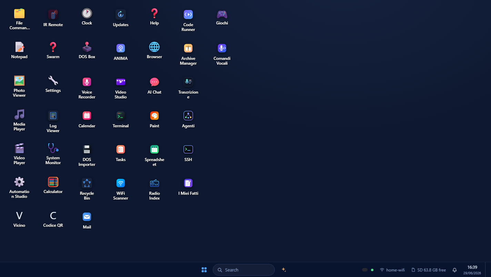

</div>

---

## Why NucleoOS is the best system for the Cardputer

Most Cardputer firmwares are a menu of tools. **NucleoOS is an actual OS** — a registry of
capability‑scoped apps, an event‑sourced bus, pairing/auth, OTA with rollback, an i18n engine,
notifications, a power manager, and **two complete user interfaces** that share one contract:

| | **Native firmware** (on the 240×135 screen) | **NucleoOS Web** (any browser on your LAN) |
|---|---|---|
| Runs | On the ESP32‑S3 itself | Served *by* the device, rendered in your browser |
| Strength | Always there, no host, smartwatch‑style UX | Desktop‑class windows, mouse + keyboard, big screen |
| Examples | Games, security tools, sensors, media, ANIMA chat | File manager, spreadsheet, Paint+AI, Game Center, IDE |
| Design rule | Large fonts, every pixel, autocomplete/history/1‑9 quick‑select | Real windows, fullscreen apps, drag‑and‑drop |

The split is deliberate: **heavy work goes to the browser, never to the 18 KB device heap.**
That is the single idea that lets a no‑PSRAM microcontroller host an experience this large.

<div align="center">
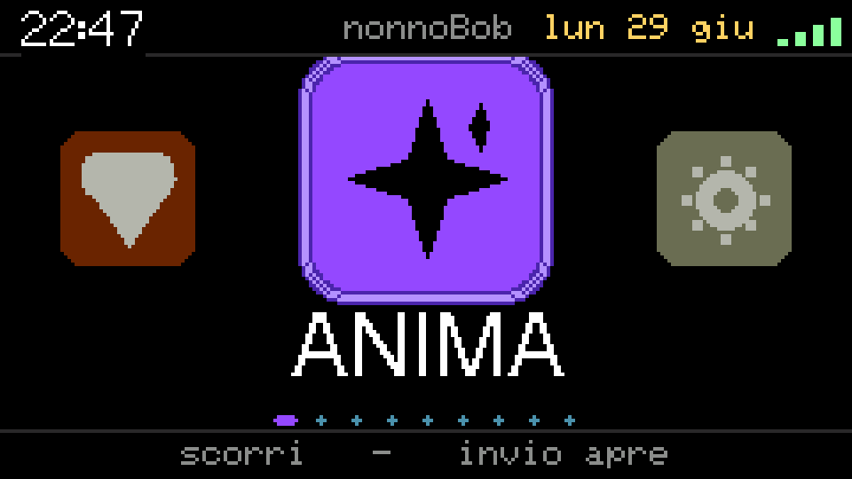
<br><sub>The native on‑device launcher (240×135), captured live over Wi‑Fi from the device's own
<code>GET /api/screen</code> endpoint — it streams the physical panel as a BMP, no canvas, ~0 heap.</sub>
</div>

---

## ⭐ Headline features

### 🧠 ANIMA — an AI assistant that works fully offline

ANIMA is NucleoOS's assistant, and it runs in **two places at once**:

- **On the firmware** — a real offline NL engine in C (retrieval cascade L0/L1/L2, neuro‑symbolic
  reasoning, knowledge graph, math/units, learn & profile tiers). No cloud, no LLM, grounded by
  construction — so it never hallucinates a fact it doesn't have.
- **In the web shell** — the same assistant compiled to **WebAssembly**, running *entirely in your
  browser*: offline, private, instant. It opens apps, does math, tells time/date, creates files,
  answers questions and learns what you teach it — nothing leaves the device.

<div align="center">
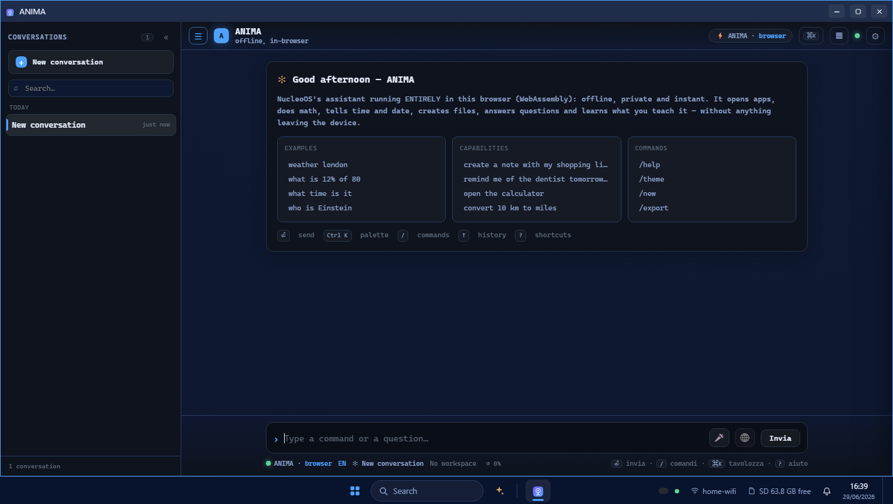
</div>

**🔊 Bilingual offline voice.** ANIMA *speaks* — a concatenative TTS engine (IT/EN) that
pre‑vocalizes a finite, grounded vocabulary on the PC and pastes the right clips at runtime:
natural voice, ~zero RAM, completely offline. It reads the time to the exact minute, confirms
launches ("Opening music"), states status — and politely says *"read it on screen"* for anything
that shouldn't be spoken aloud. See [`docs/tts.md`](docs/tts.md).

### 🤝 Real AI, integrated OS‑wide

When you *do* want a frontier model, NucleoOS wires it in cleanly:

- **OS‑wide copilot** — summon AI from anywhere with `Ctrl/⌘ + Space`.
- **Pluggable providers** — Claude, Groq, Grok (xAI), Gemini. Configure one (or several, with
  automatic fallback). Keys are stored **on the device SD, never logged**, and the browser talks
  to the provider directly — the Cardputer isn't in the loop.
- **AI Chat** talks straight to the model; **ANIMA** stays offline. You choose per task.

<div align="center">
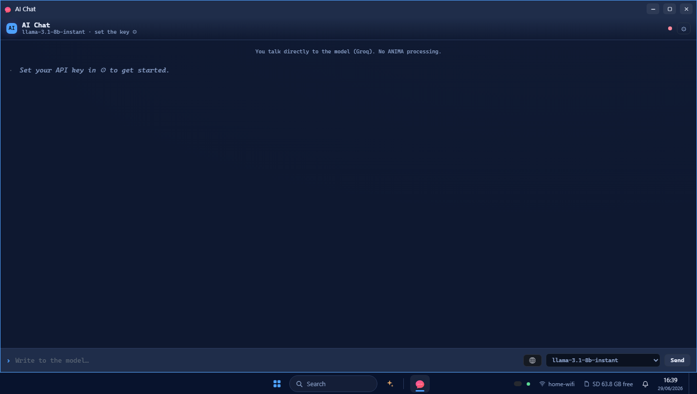
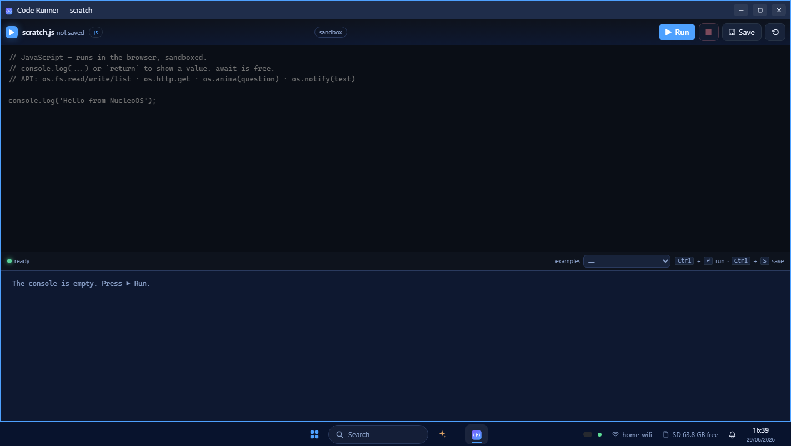
</div>

- **ANIMA Code** — a sandboxed JavaScript runtime in the browser with an `os.*` API
  (`os.fs`, `os.http`, `os.anima`, `os.notify`): write a script, hit Run, drive the OS.
- **ANIMA Chat / Agents** — multi‑turn chat and a browser‑hosted multi‑agent runtime for online work.

### 🎙️ Voice, transcription & remote recording

- **On‑device transcription** — speak into the Cardputer mic and watch text appear, on‑device, via
  a Vosk WASM model. IT/EN, summarize, screen‑off while listening to save battery.
- **Record & transcribe in real time, remotely** — start a recording on the Cardputer and stream it
  live to NucleoOS Web (`/api/rec/stream`) for real‑time transcription on the big screen.
- **Mic Spectrum** — a live FFT analyzer on the native screen.

<div align="center">
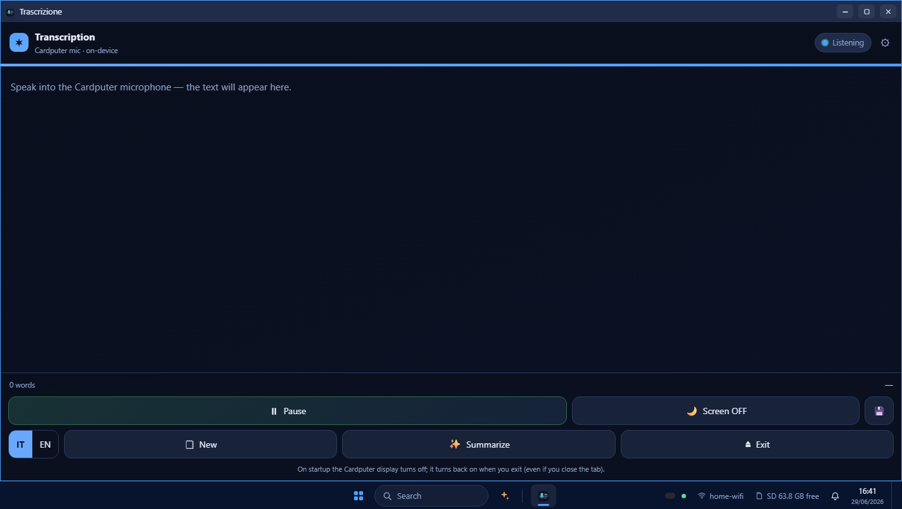
</div>

### 🎨 Offline image generation & editing (WebGPU)

**Paint** is a full image editor — layers, tools, adjustments, transforms — with an **AI side
(Atelier)** that generates and manipulates images **locally via WebGPU**, no server: *"create a cat
icon"*, *"remove the background"*, *"brightness +20"*, *"rotate right"*. Heavy pixels live in the
browser GPU; the device just stores the result.

<div align="center">
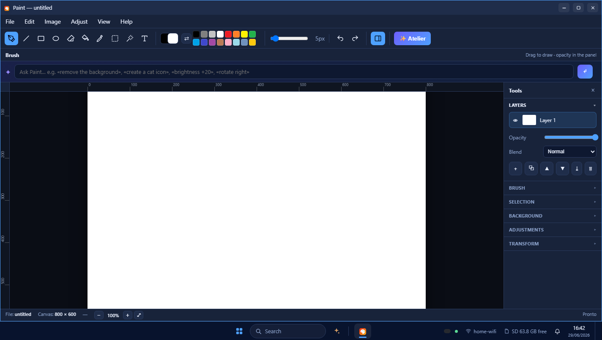
</div>

### 🎮 Games — native multiplayer + a web Game Center

- **Native multiplayer** over **ESP‑NOW** (no router): Pong, Snake Duel, Tank Duel, plus a full
  beat‑'em‑up (Scorribanda), Pinball, Tanks artillery, Poker, Slots, Yahtzee, Dice and 3D
  constellations — each rebooting into a fresh heap for maximum RAM.
- **Game Center (web)** — peer‑to‑peer over WebRTC with the Cardputer as signaling: Tic‑Tac‑Toe,
  Connect 4, Pong — 2‑player **or vs ANIMA** (offline brain, or an LLM brain when online).

<div align="center">
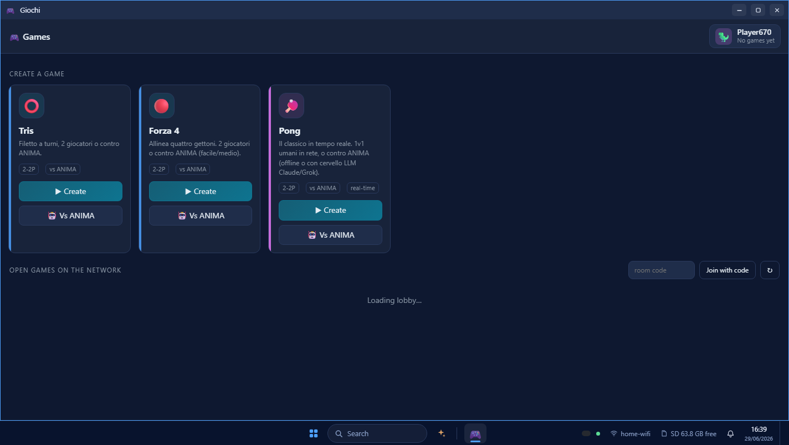
</div>

### 🎬 Media — native player, MP3 & radio

- **Film player (native)** — plays `.nfv` (MJPEG + MP3) straight off the SD with seek.
- **MP3 player (native)** — dual‑mic aware, browses folders, reads duration from headers.
- **Radio (native)** — multi‑station internet radio with a twin web app.

<div align="center">
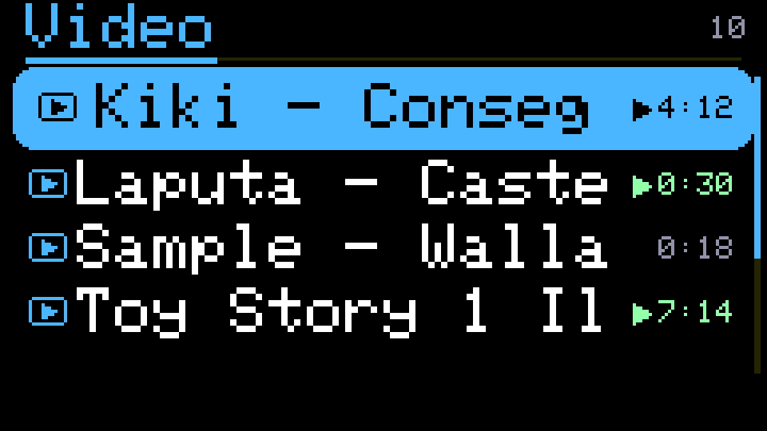
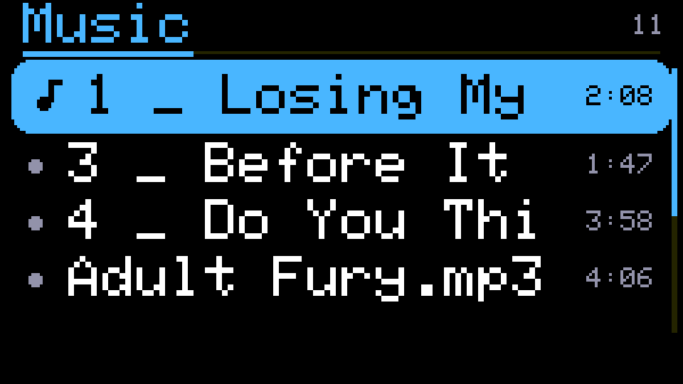
</div>

### 🛡️ Security lab

A clean‑room offensive/defensive toolkit (native firmware apps):

- **WiFi Sniffer** — promiscuous capture → `.pcap` on SD, live breakdown, radiotap, radar view.
- **Evil Portal** — captive‑portal testing.
- **WiFi Attacks** — deauth/beacon/probe suite (clean‑room).
- **BLE Suite** — scan / spam / iBeacon.
- **Ethernet (W5500)** — raw L2/L3 MACRAW attacks over the SD bus.
- **Payloads / BadUSB** — DuckyScript runner with dry‑run.
- **USB Keyboard PRO** — HID injection, macros, IT/US layouts.

### 🧰 Pocket instruments (native sensors)

Turn the Cardputer into a Swiss‑army tool: **Torch**, **Bubble Level**, **Protractor**
(goniometer), **Alarm** (siren armed by microphone + accelerometer + IMU), **Pedometer**
(step counter), **Mic Spectrum**, plus Clock, Calendar, Weather, IR Remote, QR and PixelFix.

### 💻 SSH — an evolved terminal, both sides

A real SSH terminal that reaches your hosts through a tiny self‑hosted **bridge** (no third party) —
available as a **native app** on the Cardputer *and* as a full **web terminal** with saved hosts.

<div align="center">
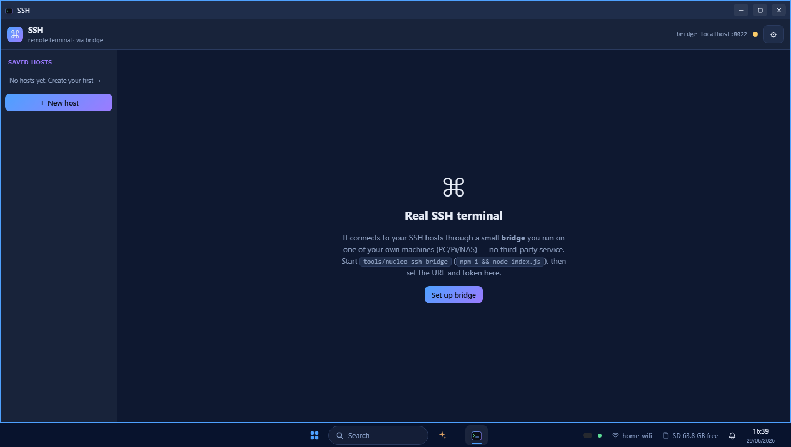
</div>

### 🗂️ A desktop‑class workstation in the browser

File Commander, Spreadsheet (SUMIFS/VLOOKUP/IF with an ANIMA copilot), a live System Monitor,
Settings Control Center, Notepad, Calculator, DOSBox, and more — real windows, fullscreen,
drag‑and‑drop, Start menu and search.

<div align="center">
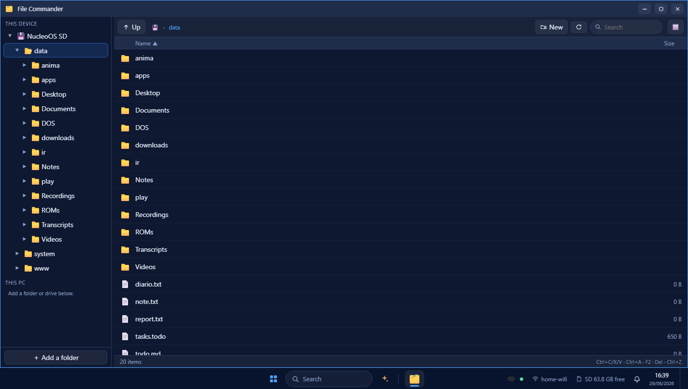
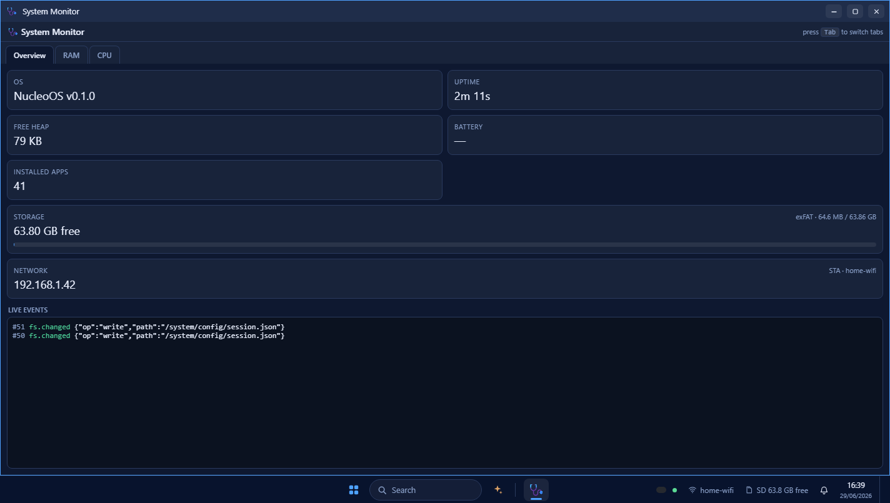
</div>

<div align="center">
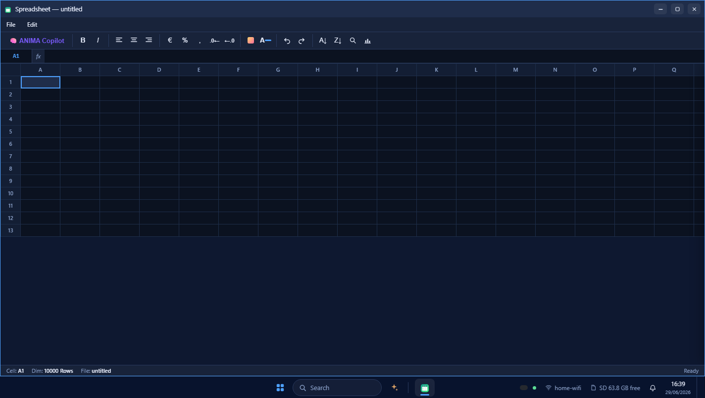
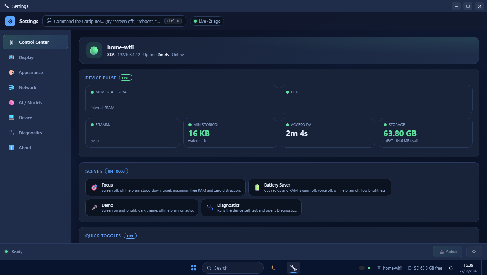
</div>

---

## 🔬 Innovations under the hood

The apps are the surface. These are the engineering bets that make them possible on a
no‑PSRAM microcontroller — and several have no equivalent in other Cardputer firmwares.

### One assistant, three runtimes, proven identical

ANIMA's offline brain is written once in C and runs in **three** places, certified to give the
**same answer** in each:

1. **On the ESP32‑S3** (the device firmware).
2. **In your browser** — the exact same C **compiled to `wasm32`** (`anima-local.wasm`), so the
   web shell's assistant is offline and private, not a reimplementation.
3. **On the PC host harness** (`anima.exe`) for development and gates.

A **parity gate** runs every query through the WASM module *and* the native build and asserts
byte‑identical replies; a **web‑contract gate** pins every JSON field the chat UI reads. The
"cascata WASM" isn't a port — it's literally the device's C, recompiled.

### The retrieval cascade — cheap first, honest always

```
query → L0  intent/FAQ string match           (<1 ms, no SD, no model)   70–90% of use
        L1  binary Hamming (popcount) coarse  + int8 rerank, confidence‑gated
        L2  MOSAICO span‑stitch — verbatim, attributed (never fabricated)
        L3  optional cloud LLM — else an honest "I don't know"
```

- **No‑FPU‑friendly:** Matryoshka **binary** embeddings (~64 B), distance = `popcount(a XOR b)` —
  pure integer math, ideal for an MCU. int8 rerank only for the few survivors (~tens of KB/query).
- **Matryoshka speculative prefetch:** the 16‑dim embedding prefix prefetches the likely SD
  clusters on core 1 while core 0 finishes the full encode — compute overlaps slow storage.
- **Evidential abstention (CRAG‑style gate):** high → frozen answer, medium → stitch, low →
  refuse. It **never hallucinates a fact it can't support.** Live data (time/battery/files)
  always bypasses the cache.
- **Neuro‑symbolic core:** HDC/VSA hyperdimensional reasoning (XOR/popcount bind‑bundle) + a
  permutation‑KGE deductive engine (inverse/transitive/multi‑hop) + a math/physics/vector solver,
  with a proof‑carrying mode (NSPCG) in Forge.

### Browser does the heavy lifting (WebGPU + WASM)

The device never streams model weights. Anything heavy is offloaded to the browser:
**WebLLM (Qwen2‑0.5B, WebGPU)** and **wllama** for real in‑browser LLM work (Forge),
**ONNX Runtime Web** for offline diffusion (Paint/Atelier), **ffmpeg.wasm** for Video Studio.

### Wired Ethernet attack engine (W5500 module)

A clean‑room **MACRAW** Layer‑2/3 engine (`nucleo_eth`) over a self‑written W5500 driver — not
lwIP, not Bruce source. It includes a **hand‑rolled DHCP client** that self‑configures with *no
TCP/IP stack*, OUI vendor fingerprinting, and operations most firmwares lack:

| Op | What it does |
|---|---|
| Scan | ARP sweep of the subnet → host list + OUI vendor fingerprint |
| MITM | bidirectional ARP spoof victim↔gateway — **reversible** (heals the caches it poisoned on exit) |
| Poison / Starve / Flood | ARP chaos · DHCP pool exhaustion · switch‑CAM MAC flood |
| Rogue DHCP | answer DISCOVERs as a rogue server → redirect router/DNS to us |
| PCAP | passive capture to an SD `.pcap` |

Strict discipline: **exactly one op at a time** (start = stop‑heal‑free the previous), every active
attack is **consent‑gated**, and the app declares `NX_NET_APP` so the OS reclaims ~70 KB while it runs.

### Surviving 512 KB with no PSRAM (the real magic)

Every demanding feature respects a tight set of RAM tricks, validated on hardware:

- **Exclusive mode** — apps reclaim ~47 KB by taking httpd + ANIMA L1 + mDNS down for their run.
- **Heap‑on‑enter** — big buffers allocate on entry, never in `.bss` (a `.bss` array once bricked the ADV).
- **Solo boot** — an RTC flag skips httpd/mDNS for a contiguous heap; each game reboots into a fresh one.
- **Canvas‑free OTA** — the framebuffer auto‑frees at idle so an update finds enough contiguous heap.
- **Heavy‑work arbiter** — one TLS session at a time (503 if busy); online ANIMA gated on
  `block ≥ 18 KB AND free ≥ 40 KB`. Plus FATFS WL‑sector‑512 (+33 KB), web‑focus screen‑off
  (+32 KB), and `-Os`/Lua‑strip size work (≈37 % flash free).

### Platform plumbing

- **Universal binary** — one image auto‑detects the **original Cardputer vs ADV** (TCA8418 keymap +
  ES8311 codec HAL) at runtime: build once, ship to both.
- **Event‑sourced bus** — append‑only state deltas → observability, replay, undo; extends across
  **ESP‑NOW** peers (the swarm/CHORUS model) for shared clipboard, multiplayer and sensor mesh.
- **Multi‑runtime apps** — `web` (zero device RAM) · `vm` (sandboxed on‑device bytecode) ·
  `service` (native C) · `elf` (PSRAM‑gated). Install/run without reflashing.
- **OS services** — capability‑scoped manifests, OTA A/B with rollback, PIN pairing + cookie auth,
  delta SD‑sync (never `/MIR`), OS‑wide live IT/EN i18n, notifications, an OS‑wide **mic gate** and
  **download gate** (Web Locks), and a service‑worker update gate.
- **Robustness gates** — a hallucination stress suite (485 metamorphic sentences, 40 gates), corpus
  dedup/quality gate, and an auto‑evolving knowledge graph (Wikipedia + teacher‑LLM, AUG‑192 encoder).

---

## 📇 Complete catalog

### Native firmware apps (run on the Cardputer screen)

| Category | Apps |
|---|---|
| **Assistant & voice** | ANIMA chat · Recorder (MP3, dual‑mic + live transcription) · Mic Spectrum (FFT) · Voice Trainer / keyword + PTT (AVCEB MFCC·CMN·DTW) |
| **Security — Wi‑Fi/BLE** | WiFi Sniffer (→ `.pcap`) · Evil Portal · WiFi Attacks (deauth/beacon/probe) · BLE Suite (scan/spam/iBeacon) · Beacon |
| **Security — wired/USB** | Ethernet/W5500 L2‑L3 engine · Payloads / BadUSB (DuckyScript) · USB Keyboard PRO (HID, macros, IT/US) |
| **Media** | Film player (`.nfv` MJPEG+MP3, seek) · MP3 player · Radio (multi‑station) · Photos |
| **Instruments & sensors** | Torch · Bubble Level · Protractor · Alarm (mic + accelerometer + IMU) · Pedometer · Weather · IR Remote · QR · PixelFix · Screensaver |
| **System** | WiFi manager · Settings/Theme · Clock · Calendar · Notepad · Calculator · System Monitor · Notifications · Info · Mail (SMTP) · SSH terminal |
| **Games** | Pong · Snake Duel · Tank Duel · Tanks (artillery) · Scorribanda (brawler) · Pinball · Poker · Slots · Dice · Yahtzee · Constellations (3D) · Reactor · Sand Garden — via the **GameFront** carousel |

### Web apps (NucleoOS Web — served by the device, run in your browser)

| Category | Apps |
|---|---|
| **AI** | ANIMA (offline WASM) · AI Chat (Claude/Groq/Grok/Gemini) · ANIMA Code · Agents · OS‑wide copilot |
| **Creativity & media** | Paint + Atelier (WebGPU image gen) · Video Studio · Video Player · Media Player · Radio · QR |
| **Productivity** | File Commander · Spreadsheet (+ANIMA copilot) · Notepad · Calculator · Calendar · Tasks · Archive Manager · Mail |
| **Dev & system** | Code Runner · Terminal · SSH · System Monitor · Settings · Log Viewer · Updates · Recycle Bin · Help · Browser |
| **Voice** | Transcription (Vosk WASM, on‑device + remote realtime) · Recorder · Voice Manager · Dictation |
| **Play & connect** | Game Center (WebRTC P2P) · Games · DJ · DOSBox (+ DOS Importer) · Nearby · Swarm |

> Apps are capability‑scoped (each declares its permissions) and most cost **~0 device RAM** — they
> are files on the SD, rendered by your browser. The registry is the single source of truth.

---

## Hard constraints — design for the worst case

NucleoOS exists *because* the hardware is brutal. Every feature above respects these:

- **RAM:** ~512 KB SRAM, **no PSRAM**. Runtime heap ~18 KB; the real enemy is *fragmentation*
  (httpd + ANIMA L1 + workers), not CPU. Heavy data never loads on the device — it goes to the
  browser. Native apps allocate on‑enter and run **exclusive**. See [`docs/memory-budget.md`](docs/memory-budget.md).
- **Battery:** ~120 mAh — energy is a first‑class system resource; every service declares a budget.
- **Storage:** microSD (system in flash, content on SD).
- **Recovery first:** OTA updates fail without bricking (A/B partitions + rollback).

---

## Repository layout

```
docs/              Engineering specs — one focused file each (the canonical knowledge base)
schemas/           JSON Schemas — shared contract for firmware / PC / Android
registry/          Live OS registry: installed apps, settings, file associations, app aliases
apps/<id>/www/     One folder per web app + manifest.json (.gz built alongside)
firmware/          ESP‑IDF firmware (boot, SD, registry, HTTP/WS, ANIMA C core, native apps)
  components/nucleo_app/      Native firmware apps (games, security, sensors, media, ANIMA…)
  components/nucleo_anima/    Offline NL engine (retrieval cascade, KG, reasoning)
  components/nucleo_tts/      Offline concatenative bilingual voice
  components/nucleo_*/        HAL + services: codec, httpd, ir, ble, smtp, …
web/shell/         Desktop shell PWA (windows, taskbar, Start, copilot, i18n)
tools/             Dev tooling: validators, the host harness, the device simulator, deploy/flash
tools/anima-host/  Host gates — compile the REAL firmware C and run it on the PC
```

Start every orientation from the **docs index below** and the relevant `docs/*.md`.
`docs/` is the source of truth — prefer reading it over re‑deriving.

---

## Develop without flashing — host first, flash last

Don't iterate by flashing. The host harness compiles the **real** ANIMA C and runs it on the PC:

```bash
npm run anima -- "what is nucleoos"   # one‑shot      npm run anima       # interactive REPL
npm run anima:gate                     # the ANIMA regression gate (must be green before any flash)
npm run validate                       # registry + manifest schema + cross‑reference check
```

For web/shell work, run the zero‑dependency **device simulator** — it mirrors the device API and
serves every app, so you verify in a browser without touching hardware:

```bash
node tools/serve-shell.mjs             # http://localhost:5599
```

**Verification matrix:** `npm run validate` · `i18n:gate` · `gz:check` · `gen:api:check` ·
`anima:gate` · `test:all`. See [`docs/debugging.md`](docs/debugging.md).

> All screenshots above are captured from this simulator running the **real** shell and apps.

---

## Build & release — OTA + web API, not serial

```bash
tools/release.ps1                      # gate → build → assemble deploy/sd → SD delta‑sync → OTA
tools/release.ps1 -FirmwareOnly        # OTA the firmware only
tools/flash.ps1                        # gate → build → flash over USB (confirm only)
```

It's **one universal binary** — the same image auto‑detects the board (original Cardputer vs ADV)
at runtime, so you build once and fan out. The ANIMA gate must be green before any flash
(`release.ps1`/`flash.ps1` enforce it). See [`docs/releasing.md`](docs/releasing.md).

---

## Docs index

| File | Topic |
|---|---|
| [docs/architecture.md](docs/architecture.md) | System layers, principles, the ESP‑NOW swarm |
| [docs/memory-budget.md](docs/memory-budget.md) | How 512 KB is divided — the riskiest bet, validated |
| [docs/anima.md](docs/anima.md) · [docs/anima-native.md](docs/anima-native.md) | ANIMA: the offline assistant + native app baseline |
| [docs/anima-cortex.md](docs/anima-cortex.md) · [docs/anima-knowledge-graph.md](docs/anima-knowledge-graph.md) | Typed planning, CRAG, and the knowledge graph |
| [docs/anima-online.md](docs/anima-online.md) | Online providers (Claude/Groq/Grok/Gemini) + multi‑turn |
| [docs/tts.md](docs/tts.md) · [docs/voice.md](docs/voice.md) | Offline bilingual voice + the voice keyword/PTT engine |
| [docs/media.md](docs/media.md) | Playing MP3/video on one ESP — client‑decode strategy |
| [docs/device-ui.md](docs/device-ui.md) | Native on‑device UI: Wear‑OS‑style launcher, UX tricks |
| [docs/i18n.md](docs/i18n.md) | OS‑wide internationalization engine (IT/EN) |
| [docs/event-protocol.md](docs/event-protocol.md) | Delta event protocol over Wi‑Fi / BLE / WebUSB |
| [docs/app-manifest.md](docs/app-manifest.md) · [docs/app-runtimes.md](docs/app-runtimes.md) | App bundle manifest + multi‑runtime model |
| [docs/registry.md](docs/registry.md) | Registry structure and file associations |
| [docs/storage.md](docs/storage.md) · [docs/partition-table.md](docs/partition-table.md) | SD filesystem + 8 MB flash OTA layout |
| [docs/setup-wizard.md](docs/setup-wizard.md) · [docs/security.md](docs/security.md) | First‑run wizard + device pairing/session auth |
| [docs/releasing.md](docs/releasing.md) · [docs/versioning.md](docs/versioning.md) | Releasing/OTA + firmware versioning |
| [docs/debugging.md](docs/debugging.md) · [docs/testing.md](docs/testing.md) | Default dev loop (host harness) + the test suites |
| [docs/roadmap.md](docs/roadmap.md) | What's next to be a real, modern OS |

---

<div align="center">

**NucleoOS** — a microcontroller that thinks it's a workstation.
Built for the M5Stack Cardputer · English‑only codebase · designed for the worst case.

</div>
